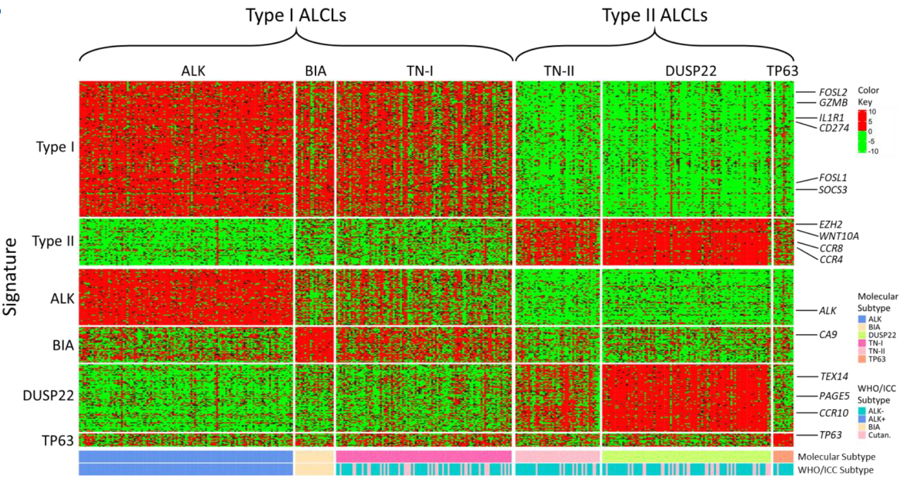

## ALCL subtyping using RNAseq data 
This repository documents a pipeline to reproduce ALCL subtyping (molecular classification) based on Feldman et al., 2026 
Fig. 6B from paper:

Reference:
Feldman, A.L., Dasari, S., Rimsza, L.M., Scott, D.W., Oishi, N., Hu, G., Farinha, P., Amador, C., Campo, E., Chan, W.C. and Cook, J.R., 2026. Gene expression profiling reveals 2 overarching types of ALCL with distinct targetable biology: an LLMPP study. Blood, 147(11), pp.1199-1214.

## ALCL subtyping using scRNAseq data 
To use the signature to classify scRNA data, below is how I would go about: 
1. Assuming you have TCR in the scRNA, you can isolate the tumor cells based on the clonal status. If you don’t have TCR in the scRNA, you would have to use a different algorithm to ID tumor cells (like CD30 or something else). 
2. Once you isolated the tumor t-cells, you can gather the signature for Type 1 (i.e. genes up regulated in Type 1) from the paper and then run AddModuleScore in Seurat using those genes. This produces a normalized score for the signature per cell. You do the same thing using signature for Type 2 and get a score. You can then compute the delta of Type 1 vs. Type 2 scores computed for each cell. You can choose a threshold, like >= +/-0.1 or something and then call the cell’s Type1 vs. Type2 status. 
3. There is also another way to do this. Assuming you isolated tumor cells from your scRNA data, you can generate a pseudobulk expression of tumor cells using Seurat. Once you have the pseudobulk data, you can treat that as any bulk gene expression data and run the Type 1 vs. Type 2 like how you did with bulk RNAseq data using heatmap and hierarchical clustering.

This ALCL subtyping method on scRNA-seq data is written after a discussion with a bioinformatician from Feldman et al., 2026

